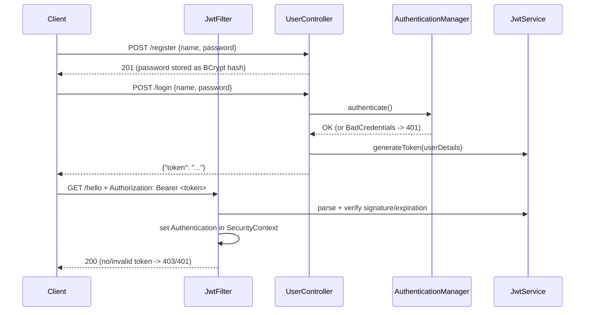

# Jwt-Demo

Reference project: Spring Security + JWT (jjwt 0.12.x), stateless authentication, MySQL.

## Flow



## Where is what

| File | Role |
|------|------|
| `configuration/SecurityConfig` | Filter chain: public `/register`, `/login`; `/admin/**` needs `ROLE_ADMIN`; STATELESS session; CSRF off |
| `configuration/JwtFilter` | `OncePerRequestFilter` - reads `Bearer` header, validates token, fills `SecurityContext` |
| `service/JwtService` | Generates and parses tokens (secret + lifetime from `application.properties`) |
| `service/CustomUserDetailsService` | Loads user from DB for Spring Security |
| `exception/GlobalExceptionHandler` | Bad credentials -> 401, duplicate user -> 409, validation -> 400 |

## Run

1. Generate a secret (Base64, min. 256 bits) and set env variables:

   ```bash
   openssl rand -base64 32
   ```

   ```
   DB_PASSWORD=<your mysql root password>
   JWT_SECRET=<generated secret>
   ```

2. Start the app (`./mvnw spring-boot:run`) and try the requests from `requests.http`.

## Notes

- Roles are stored with the `ROLE_` prefix (`ROLE_USER`), so `hasRole("USER")` works.
  A new user always gets `ROLE_USER`; to try `/admin/**`, change the role in the DB manually.
- The role is also stored as a `role` claim in the token (example of a custom claim).
- A JWT cannot be revoked before it expires - that is why the lifetime is short (`jwt.expiration-ms`).
- Never log tokens and never commit `JWT_SECRET`.

## Tests

```bash
./mvnw test -Dtest=JwtServiceTest
```

(`JwtDemoApplicationTests` needs a running MySQL and the env variables.)
